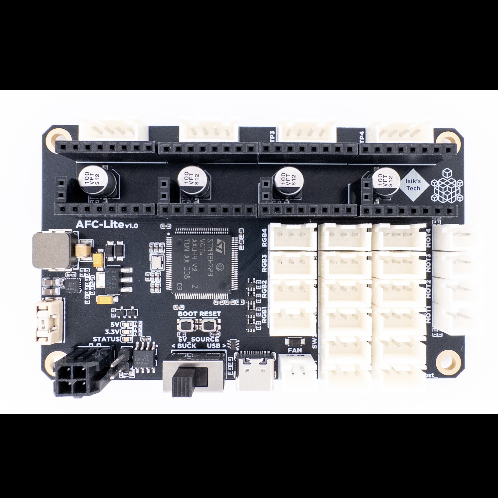

# AFC-Lite

AFC-Lite is a open-source PCB designed for Armored Turtle's Box Turtle system. It features:
- 4x Stepstick Slots for TMC2209-based Stepsticks
- 4x Brushed DC Motor Drivers
- 4x RGB LED Connectors
- 12x Endstop Connectors
- 1x 5V Fan Connector (No Speed Control)
- STM32H723 MCU
- USB and CAN Support
- 5V Buck Converter

## Purchasing a AFC-Lite
### Buy From Me (US - Ships Worldwide)
[AFC-Lite - Isik's Tech](https://store.isiks.tech/products/afc-lite)  
We also have [Full BT kits](https://store.isiks.tech/products/box-turtle-kit) and [other BT parts](https://store.isiks.tech/collections/box-turtle-parts) available.

### Australia
- [DREMC](https://store.dremc.com.au/products/afc-lite-box-turtle-controller-pcb-by-isiks-tech)
### Canada
- [Amazon](https://www.amazon.ca/dp/B0DMWB52Z3) (Ships from US)
### European Union
- [Alchemy3D (Germany)](https://alchemy3d.de/products/boxed-turtle-afc-lite-controller-pcb)
- [Lab4450 (Portugal)](https://lab4450.com/product/afc-lite-board/)
### United Kingdom
- [One Two 3D](https://www.onetwo3d.co.uk/product/isiks-tech-afc-lite-box-turtle-controller-pcb/)
### United States
- [Amazon](https://www.amazon.com/dp/B0DMWB52Z3?maas=maas_adg_A3C1FA832FBAA5A33374316DF932F9DB_afap_abs&ref_=aa_maas&tag=maas) (Prime Shipping)
### Aliexpress
- [SeleadLab](https://s.click.aliexpress.com/e/_oD9LPyv)

## Instructions
[Manual](./Docs/AFC-Lite_Manual.pdf)

## License
This work is licensed under a
[Creative Commons Attribution-NonCommercial-ShareAlike 4.0 International License][cc-by-nc-sa].

[![CC BY-NC-SA 4.0][cc-by-nc-sa-image]][cc-by-nc-sa]

[cc-by-nc-sa]: http://creativecommons.org/licenses/by-nc-sa/4.0/
[cc-by-nc-sa-image]: https://licensebuttons.net/l/by-nc-sa/4.0/88x31.png
[cc-by-nc-sa-shield]: https://img.shields.io/badge/License-CC%20BY--NC--SA%204.0-lightgrey.svg

## Notes
- Markdown files in this repository may contain Amazon Associate, Aliexpress affiliate, PCBWay affiliate, Jawstec affiliate, Polymaker affiliate links. I make a comission on qualifying purchases.
- This project does not come with any warranty, if you choose to build/use a PCB manufactured using published files in this repository, you are doing this at your own risk!
